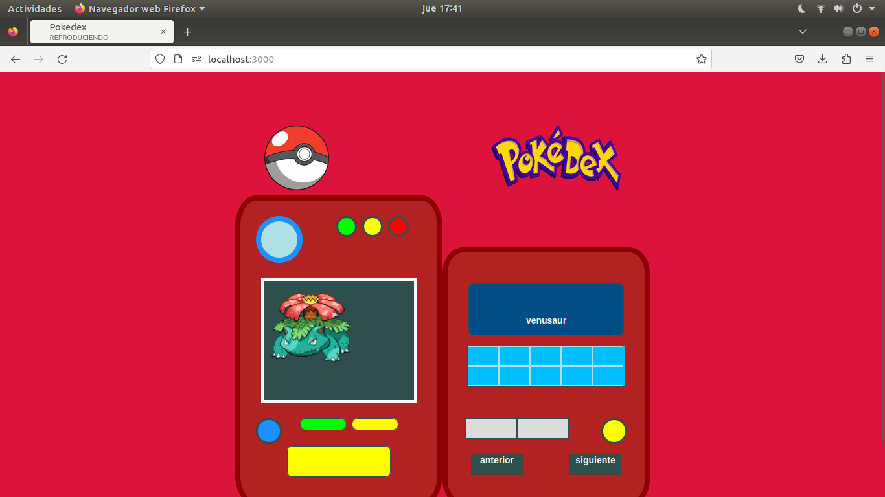

# pokedex
A simple pokedex as test-app 

## Pokedex
Pokedex is a simple project developed with express and ejs engine, also, it consumes the API named pokéAPI   https://pokeapi.co/. In this API you can find all data about pokemon and other characteristics.

# Description general 
The file index.ejs contain elements that integrate the graphic interface and all css classes, but also, it contains a few bootstrap  css classes so that speed up the development and reduce css implementation.     

In the javascript folder, you will find index.mjs file that contains the logic to control keys as the previous button and next button, but also, here it is the code to play music background or sound of a key.

The main part of this file is the POST request, it  does a request to /pokeapi route ubicated in the routes folder then it does GET request to pokeapi , so which receives data of pokemon such as the image of pokemon and its name; 

# Extras 
In general, the project works well, it has two buttons that you can click on it to watch a pokemon image and heard the sound of keys. 

You can improve this project if so you wish, for example, you can add more functionalities as do that the sound of the click works correctly when you click on it twice in a row, also you can retrieve more data from pokeAPI or improve the interface.

### install
Install the project as follow

* npm install 
* npm run start 
* in your web browser in the search bar type this : localhost:3000/

you would be able to see the interface

# this project was developed in a linux environment.